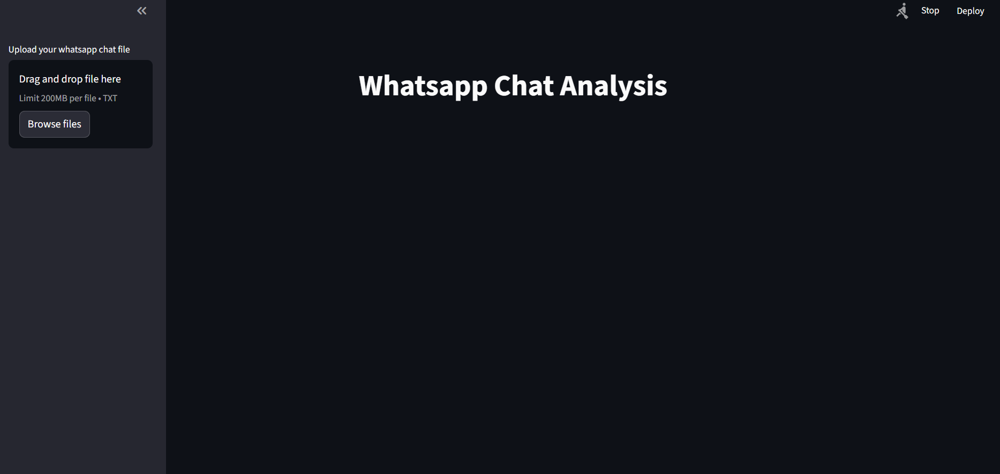
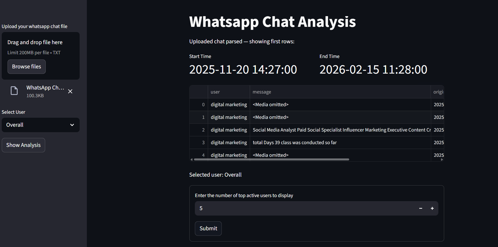
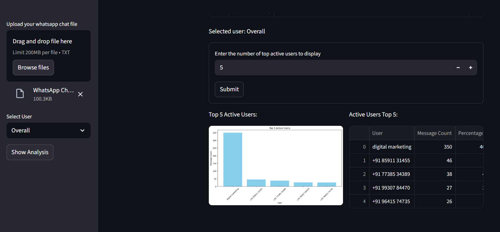
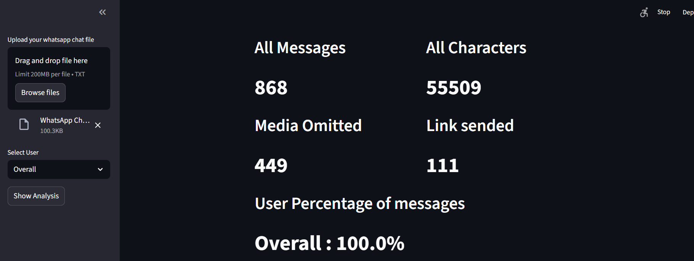
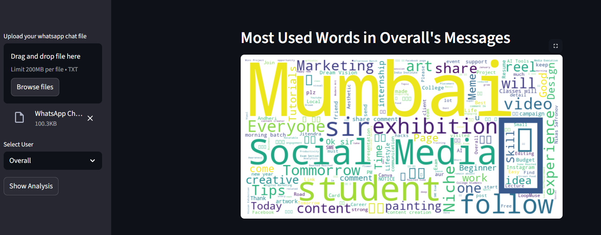
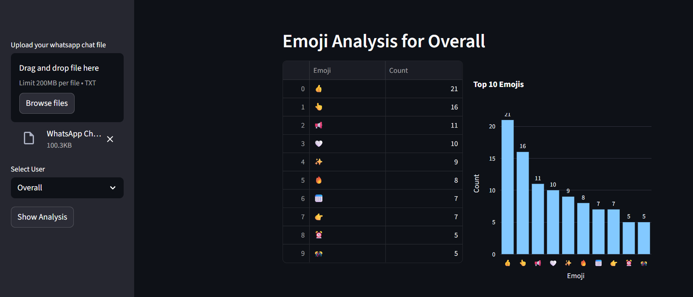
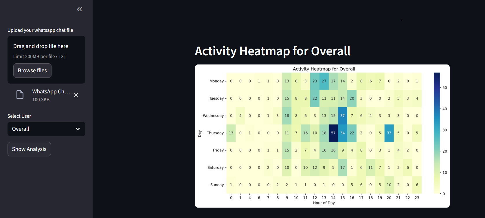
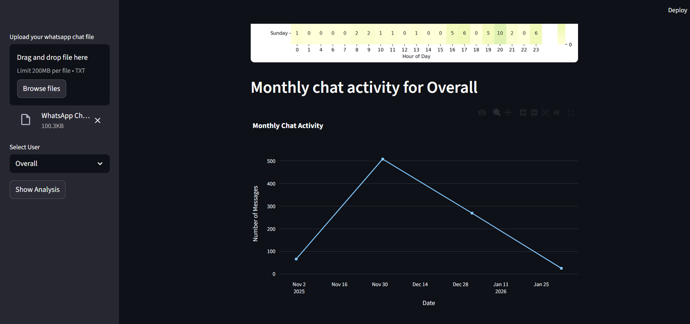

# WhatsAppChatAnalysis
An end-to-end WhatsApp Chat Analysis Web Application built using Python, Pandas, and Streamlit. This project extracts meaningful insights from exported WhatsApp chat data and presents them through an interactive analytics dashboard.

#NLP Prject overview
This project also contain NLP releated feautere where i fine tune bert multilingual model for toxicity and sentiment detection for every user or overall and then you can see what user are most sad in talking or talk toxicity words in hinglish and english both work perfectly fine using hugingface trainer (full fine tune). and i also use custom class of giving manual weight for model in sentiment analysis becaseu i use two model english and higlish seperately.

The docker image full run in your pc:-
https://hub.docker.com/r/anas0308/whatsapp-chat-analyzer

this is the first impression page where you have to uploade the chat txt file (from whatsapp)

After uploading the chat file this is upper body you see like starting date and ending date and most active user etc

Then you click the submit button for for seeing the active users the for finding the active user 

Then Click for anlysis button for analysing the data you can go for Overall or Indivitual depends upon you

## Feature Selection
- Total Messages Count
- All Charecter Shared
- Media Shared Count
- Links Shared Count
- Most Active Users
- Monthly & Daily Timeline
- Activity Heatmap
- Emoji Analysis
- Word Frequency Analysis
- User Contribution percentage

## Tech stack
- Python
- Pandas
- NumPy
- Matplotlib
- Seaborn
- Plotly
- Streamlit
- Regex

## How to Run
1. Clone the repository:
git clone https://github.com/anasansari9994-lang/WhatsAppChatAnalysis.git
2. Install dependencies:
pip install -r requirements.txt
3.Run the app:
streamlit run app.py or python -m streamlit run app.py

## project Structure

WhatsAppChatAnalysis/
│
├── app.py
├── analysis.py
├── requirements.txt
├── images/
└── README.md

##  Future Improvements

- Sentiment Analysis
- Word Cloud Visualization
- Chat Comparison Feature
- Deploy on Streamlit Cloud
- Export Reports as PDF

## 👤 Author

Anas Ansari  
GitHub: https://github.com/anasansari9994-lang
